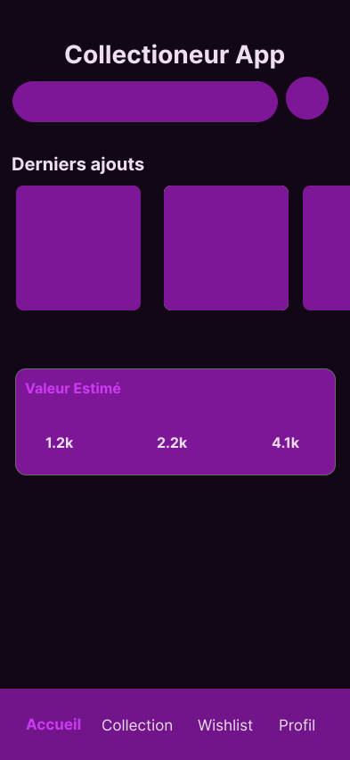
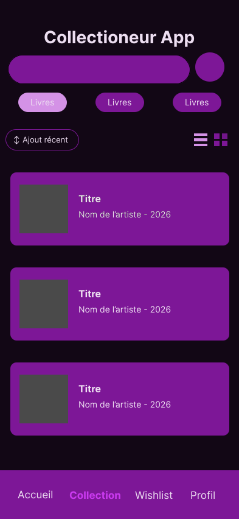
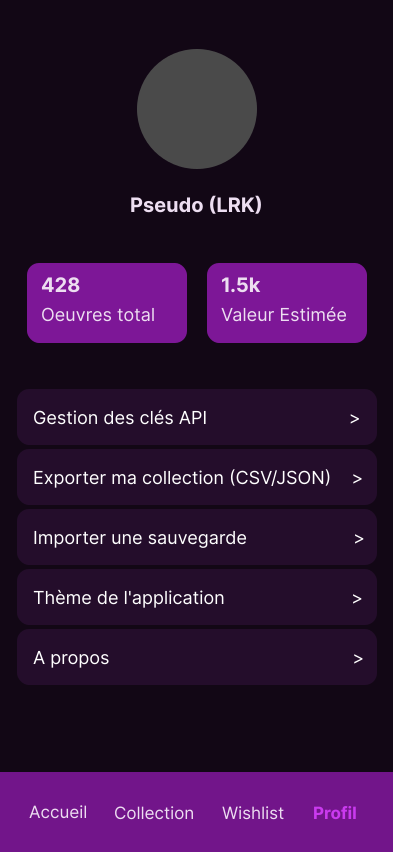

# Collection Manager

Une Progressive Web App (PWA) auto-hébergée pour gérer facilement ses collections physiques (Vinyles, CDs, Bandes Dessinées). 
Conçue avec une approche Mobile-First pour permettre le scan rapide de codes-barres directement depuis un smartphone.

## Stack Technique

- **Frontend :** React.js (PWA)
- **Backend :** Node.js & Express
- **Base de données :** MongoDB (NoSQL) ou PostgreSQL (SQL)
- **Hébergement :** Proxmox (Conteneur LXC) / Docker

## 🔗 Documentation

- [Cahier des charges et fonctionnalités (MVP & V2)](docs/features.md)
- [Lien vers les maquettes Figma](https://www.figma.com/design/71dOwCcKUDi9yuPvo09Y9r/Sans-titre?node-id=8-12&t=Vc8VUhVkFoIAyWaZ-1)

## 🎨 Maquettes de l'application

---
*Projet personnel développé parce que les applications sont freemium.*