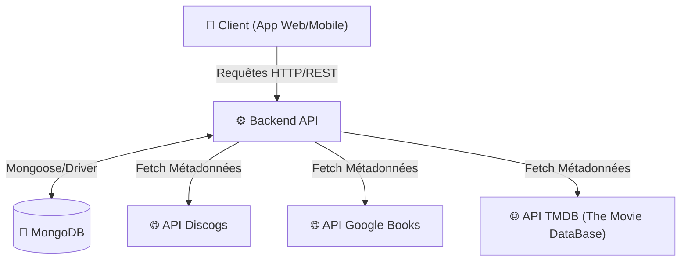

# 🏛️ Architecture du Projet

Ce document décrit l'architecture technique, l'infrastructure d'auto-hébergement et le modèle de données de l'application.

## 1. Vue d'ensemble (Infrastructure)

L'application est pensée pour être **auto-hébergée** sur un serveur personnel (Proxmox) via des conteneurs. 

* **Frontend :** Application web orientée mobile (Mobile-First) en React.
* **Backend :** API RESTful (Node.js / Express) qui gère la logique et fait l'interface avec les API externes pour protéger les clés.
* **Base de données :** MongoDB (NoSQL) pour sa flexibilité avec les différents types de médias.

### Schéma de flux


## Modèle de Données (NoSQL)
Nous utilisons une approche polymorphique pour la collection principale Items, ce qui permet de stocker des Vinyles, des BDs et des Livres dans la même collection tout en gardant des métadonnées spécifiques à chaque type.

* **A. Collection ```Users```**
Gère l'administrateur de l'instance, ses préférences d'interface (couleurs, vues) et sécurise ses clés d'API tierces.
```JSON
{
  "_id": "user_001",
  "username": "Admin",
  "email": "contact@domaine.com",
  "created_at": "2026-02-28T10:00:00Z",
  "preferences": {
    "theme": "dark",
    "primary_color": "#d492e6",
    "default_view": "list"
  },
  "api_keys": {
    "discogs_token": "secret_token",
    "google_books_api": "secret_key",
    "tmdb_api_key": "secret_api_key"
  }
}
```
* **B. Collection ```Items``` (Les Œuvres)**
Le cœur de la base de données. Le champ ```type``` détermine le contenu du bloc ```metadata```.
Exemple : Un Vinyle
```JSON
{
  "_id": "item_9920",
  "type": "music",
  "title": "Deux Frères",
  "cover_url": "https://...",
  "barcode": "000000999999",
  "added_at": "2026-02-28T22:00:00Z",
  "estimated_value": 25.50,
  "metadata": {
    "artist": "PNL",
    "genres": ["HipHop", "Rap"],
    "label": "QLF",
    "country": "France",
    "release_year": 2019,
    "format": "Vinyl, LP, Album",
    "notes": "Édition double vinyle noir."
  }
}
```
Exemple : Une Bande Dessinée
```JSON 
{
  "_id": "item_9921",
  "type": "comic",
  "title": "Quelque part entre les ombres",
  "cover_url": "https://...",
  "barcode": "9782205049657",
  "added_at": "2026-02-28T22:05:00Z",
  "metadata": {
    "author": "Juan Díaz Canales",
    "illustrator": "Juanjo Guarnido",
    "publisher": "Dargaud",
    "series_id": "serie_8854", 
    "volume_number": 1
  }
}
```
Exemple : Un film
```JSON
{
  "_id": "item_9922",
  "type": "movie",
  "title": "Mullholand Drive",
  "cover_url": "https://...",
  "barcode": "5051889482121",
  "added_at": "2026-02-28T22:15:00Z",
  "estimated_value": 15.00,
  "metadata": {
    "director": "David Lynch",
    "genres": ["Film Noir", "Strange"],
    "format": "Blu-Ray 4K", 
    "studio": "StudioCanal",
    "release_year": 2014,
    "runtime": 147,
    "notes": "Édition Steelbook Collector, inclut le disque bonus."
  }
}
```

* **C. Collection ```Series```**
Permet de regrouper logiquement les tomes d'une même œuvre (utile pour les BDs et Mangas).
```JSON
{
  "_id": "serie_8854",
  "type": "comic",
  "name": "Blacksad",
  "publisher": "Dargaud",
  "status": "En cours",
  "total_volumes": 7
}
```
